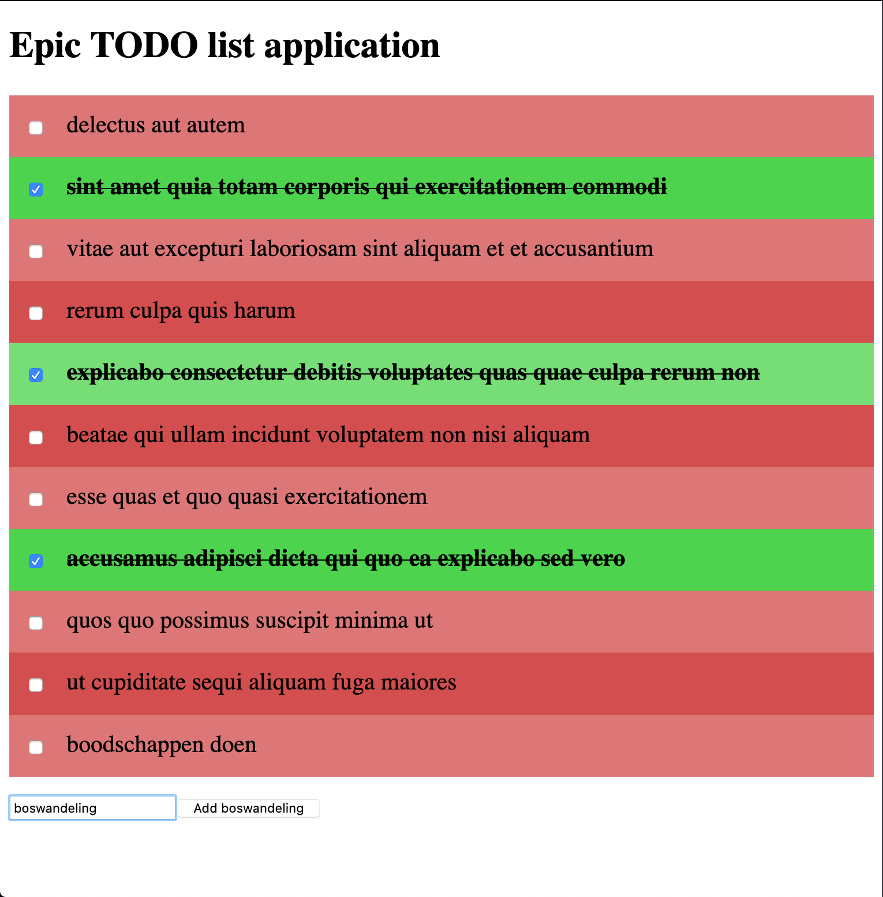

# vue-todo

This is a revolutionary TODO application built in Vue. Here are its features:

- Creating TODO items;
- Marking TODO items as 'done';
- _WIP: Marking TODO items as 'not done';_
- A very contemporary, expandable and intuitive layout;
- Incredibly fast load times.

**Warning**: using a TODO list application will never be the same. Here's the state-of-the-art user interface:

